# BÀI TẬP 1: SỬA LỖI HARDCODE URL TRONG RESTTEMPLATE CỦA ORDER-SERVICE
## Giải Cứu API Khuyến Mãi Khỏi "Nghẽn Cổ Chai" & Sập Dây Chuyền

> **Mã bài tập:** `SPRING-CLOUD-S10-EX01` (Tương đương `S06-EX01`)  
> **Khóa học:** Microservices System Design — Session 10 / Session 06: Rikkei Education  
> **Cấp độ:** Vận dụng cơ bản  
> **Dự án:** Nền tảng Thương mại Điện tử VietMart (**VietMart E-Commerce Platform**)  
> **Module:** `order-service` $\rightarrow$ `product-service`  
> **Công nghệ áp dụng:** Spring Boot 3.x, Spring Cloud Netflix Eureka, Spring Cloud LoadBalancer, RestTemplate, JUnit 5, Mockito  

---

## 1. Bối cảnh & Hiện trạng Sự cố

Hệ thống VietMart vận hành theo kiến trúc Microservices. Trong luồng đặt hàng, `order-service` cần gọi sang `product-service` để lấy thông tin chi tiết tên, giá, số lượng tồn kho của sản phẩm phục vụ hiển thị và xác thực đơn hàng. Hệ thống sử dụng **Netflix Eureka** làm Service Registry & Discovery để các service tự động đăng ký và tìm kiếm nhau.

Một thực tập sinh đã viết lớp `ProductServiceClientRT` để thực hiện việc gọi API. Khi chạy ở máy cá nhân (môi trường Local Dev), code hoạt động bình thường, nhưng ngay khi đưa lên môi trường **Staging / Production**, hệ thống lập tức sụp đổ.

### Đoạn code đang có lỗi:
```java
// ProductServiceClientRT.java -- CODE ĐANG CÓ LỖI
@Component
public class ProductServiceClientRT {

    // LỖI 1: Không dùng @LoadBalanced RestTemplate -- không qua được Eureka
    private final RestTemplate restTemplate = new RestTemplate();

    public ProductInfo getById(Long productId) {
        // LỖI 2: Hardcode IP:port thay vì dùng service-id
        String url = "http://192.168.1.45:8082/api/products/{id}";

        // LỖI 3: Không có timeout -- thread có thể bị block mãi mãi
        return restTemplate.getForObject(url, ProductInfo.class, productId);
    }
}
```

---

## 2. Phân tích Chi tiết 3 Lỗi Kỹ thuật & Hậu quả trong Môi trường Production

### 🔴 Lỗi 1: Tự khởi tạo `new RestTemplate()` và không sử dụng annotation `@LoadBalanced`
* **Bản chất kỹ thuật:**
  * Việc dùng toán tử `new RestTemplate()` phá vỡ nguyên lý **Inversion of Control (IoC)** và **Dependency Injection (DI)** của Spring. Đối tượng này là một unmanaged object, không nằm trong Spring ApplicationContext và không được hưởng các tính năng tự động cấu hình (Interceptors, Message Converters, Tracing, Metrics).
  * Đặc biệt, đối tượng này thiếu annotation `@LoadBalanced`. Trong Spring Cloud, `@LoadBalanced` đóng vai trò là qualifier đánh dấu để Spring tiêm `LoadBalancerInterceptor` (sử dụng `Spring Cloud LoadBalancer`). Interceptor này có nhiệm vụ chặn các request chứa tên dịch vụ logic (Logical Service ID), truy vấn Eureka Service Registry để lấy danh sách các IP/Port đang sống, và chọn ra một instance theo thuật toán cân bằng tải (Round-Robin).
* **Hậu quả trong môi trường Production có nhiều instance:**
  * Nếu đổi URL sang Service ID logic (`http://product-service/...`), RestTemplate thông thường sẽ coi `product-service` là tên miền Internet và truy vấn DNS máy chủ nội bộ. Do mạng hạ tầng không có DNS nội bộ cho tên này, ứng dụng lập tức ném ngoại lệ `java.net.UnknownHostException`.
  * **Mất khả năng cân bằng tải:** Trong sự kiện Flash Sale Khuyến mãi, dù DevOps có mở rộng `product-service` từ 2 lên 10 instance, `RestTemplate` này hoàn toàn không biết và không thể điều phối tải sang các instance mới.

---

### 🔴 Lỗi 2: Hardcode địa chỉ IP:Port vật lý (`http://192.168.1.45:8082`) thay vì dùng Service ID
* **Bản chất kỹ thuật:**
  * Kiến trúc Microservices hiện đại hoạt động trên hạ tầng điện toán đám mây động (Dynamic Topology) với Docker và Kubernetes. Các container có thể bị xóa, tái tạo, di chuyển giữa các Worker Node bất kỳ lúc nào với địa chỉ IP và Port được cấp phát động ngẫu nhiên.
  * Việc chỉ định cứng `192.168.1.45:8082` vi phạm nguyên lý cốt lõi **Location Transparency** (Trong suốt về vị trí địa lý).
* **Hậu quả trong môi trường Production có nhiều instance:**
  1. **Lỗi không tương thích môi trường (Environment Incompatibility):** Code chạy trên máy cá nhân của thực tập sinh (IP mạng LAN `192.168.1.45`), nhưng khi deploy lên máy chủ Staging hay Cloud (dải IP `10.0.x.x` hoặc `172.16.x.x`), địa chỉ `192.168.1.45` không tồn tại, gây lỗi `ConnectException: Connection refused` hoặc `No route to host`.
  2. **Tạo ra điểm chết đơn lẻ (Single Point of Failure - SPOF):** 100% lưu lượng đặt hàng từ `order-service` đổ dồn về một máy vật lý duy nhất. Nếu máy này gặp sự cố hoặc khởi động lại để update, toàn bộ hoạt động mua sắm của khách hàng VietMart bị tê liệt, dù 9 server còn lại của `product-service` vẫn hoạt động bình thường.
  3. **Vô hiệu hóa tính năng Elastic Scaling (Tự động co giãn):** Hệ thống không thể san sẻ tải, dẫn đến tình trạng "kẻ ăn không hết người lần chẳng ra" (node bị hardcode thì quá tải cháy CPU, các node khác thì nhàn rỗi).

---

### 🔴 Lỗi 3: Không cấu hình Timeout (`connectTimeout` và `readTimeout`)
* **Bản chất kỹ thuật:**
  * Mặc định trong Spring `RestTemplate` (sử dụng `SimpleClientHttpRequestFactory` chuẩn của JDK), cả `connectTimeout` và `readTimeout` đều nhận giá trị mặc định là **`-1` hoặc `0`**, đồng nghĩa với **VÔ HẠN (Infinite Timeout)**.
  * `order-service` chạy trên nền Tomcat với mô hình xử lý đa luồng **Thread-per-Request** (Mỗi yêu cầu từ client được phục vụ bởi 1 worker thread trong `Tomcat Thread Pool`, mặc định có kích thước 200 threads).
* **Hậu quả trong môi trường Production có nhiều instance ("Nghẽn cổ chai" & Sập dây chuyền):**
  1. **Nghẽn và cạn kiệt luồng (Tomcat Thread Starvation):** Khi diễn ra chiến dịch Khuyến mãi (Flash Sale), số lượng người truy cập tăng đột biến làm `product-service` bị quá tải (khóa database, nghẽn I/O, mạng lag). Mỗi request gọi từ `order-service` sang sẽ bị "treo" (Blocked state) ở socket vô thời hạn để chờ dữ liệu.
  2. **Sập dây chuyền toàn hệ thống (Cascading Failure):** Chỉ cần 200 request mua hàng bị treo quá vài giây, toàn bộ 200 luồng của Tomcat trong `order-service` sẽ bị chiếm dụng hết sạch. Lúc này, `order-service` không thể xử lý thêm bất kỳ yêu cầu mới nào (kể cả xem đơn hàng hay gọi health check). API Gateway gửi request tới sẽ bị quá hạn (HTTP 504 Gateway Timeout). Sự cố từ một API nhỏ của `product-service` đã lan truyền làm sụp đổ hoàn toàn `order-service` và toàn bộ nền tảng VietMart.

---

## 3. Bảng Đối Chiếu & Sơ Đồ Khắc Phục

### 3.1. Bảng đối chiếu trước và sau khi khắc phục

| Tiêu chí | Đoạn mã có lỗi (Thực tập sinh) | Giải pháp chuẩn hóa (Đã sửa) | Hiệu quả kỹ thuật |
| :--- | :--- | :--- | :--- |
| **Quản lý Bean** | `new RestTemplate()` | `@Bean` `@LoadBalanced` do Spring IoC quản lý | Tích hợp interceptor cân bằng tải, tracing, metrics |
| **Định tuyến** | Hardcode `192.168.1.45:8082` | Service ID `http://product-service` | Tự động phân giải IP qua Eureka, xóa bỏ SPOF |
| **Cân bằng tải** | Không có | Tự động chia tải (Client-side Load Balancing) | Khai thác hiệu quả mọi instance được scale-out |
| **Kiểm soát thời gian** | Vô hạn (Infinite Timeout) | `connectTimeout = 2s`, `readTimeout = 3s` | Giải phóng worker thread sau tối đa 3 giây |
| **Xử lý sự cố** | Crash / Block vô hạn | Bắt `ResourceAccessException` $\rightarrow$ Fallback | Suy thoái mượt mà (Graceful Degradation) |
| **Sản phẩm không tồn tại** | Ném lỗi không kiểm soát | Bắt 404 $\rightarrow$ `ProductNotFoundException` | Phân biệt rõ lỗi mạng và lỗi nghiệp vụ dữ liệu |

---

### 3.2. Sơ đồ luồng giải cứu API khỏi nghẽn cổ chai

```mermaid
flowchart TD
    subgraph S1["KỊCH BẢN CŨ: NGHẼN CỔ CHAI & SẬP DÂY CHUYỀN 💥"]
        C1["Khách hàng đặt hàng"] --> OS1["Order Service (200 Threads)"]
        OS1 -->|Hardcode IP: 192.168.1.45| P1["Product Service (Node 1 - Quá tải)"]
        P1 -->|Phản hồi chậm / Treo DB| WAIT["Chờ vô hạn (No Timeout) ⏳"]
        WAIT --> STARVE["Cạn kiệt toàn bộ 200 Tomcat Threads ❌"]
        STARVE --> CRASH["SẬP TOÀN BỘ ORDER SERVICE & HỆ THỐNG VIETMART"]
    end

    subgraph S2["KỊCH BẢN MỚI: LOAD BALANCING + TIMEOUT + FALLBACK ✅"]
        C2["Khách hàng đặt hàng"] --> OS2["Order Service"]
        OS2 --> LB["Spring Cloud LoadBalancer: http://product-service"]
        LB -->|Tra cứu Eureka Registry| EUR["Eureka Server"]
        EUR --> INST["Chọn Instance khỏe mạnh (Round-Robin)"]
        
        INST -.->|Nếu server phản hồi quá 3s| TO["Kích hoạt Read Timeout (3s) ⏱️"]
        TO --> FB["Fallback: Trả về ProductInfo an toàn (Status: UNAVAILABLE)"]
        FB --> REL["Giải phóng Worker Thread ngay lập tức! Hệ thống luôn sống khỏe ✅"]
    end
```



---

## 4. Mã Nguồn Đã Khắc Phục Chuẩn Xác

### 4.1. Cấu hình Bean RestTemplate (`RestTemplateConfig.java`)
```java
package com.vietmart.order_service.config;

import org.springframework.cloud.client.loadbalancer.LoadBalanced;
import org.springframework.context.annotation.Bean;
import org.springframework.context.annotation.Configuration;
import org.springframework.http.client.SimpleClientHttpRequestFactory;
import org.springframework.web.client.RestTemplate;

import java.time.Duration;

@Configuration
public class RestTemplateConfig {

    @Bean
    @LoadBalanced
    public RestTemplate restTemplate() {
        SimpleClientHttpRequestFactory factory = new SimpleClientHttpRequestFactory();
        factory.setConnectTimeout(Duration.ofSeconds(2)); // connectTimeout = 2s
        factory.setReadTimeout(Duration.ofSeconds(3));    // readTimeout = 3s
        return new RestTemplate(factory);
    }
}
```

### 4.2. Lớp Client Gọi Dịch Vụ (`ProductServiceClientRT.java`)
```java
package com.vietmart.order_service.client;

import com.vietmart.order_service.dto.ProductInfo;
import com.vietmart.order_service.exception.ProductNotFoundException;
import lombok.extern.slf4j.Slf4j;
import org.springframework.beans.factory.annotation.Autowired;
import org.springframework.beans.factory.annotation.Value;
import org.springframework.cloud.client.loadbalancer.LoadBalanced;
import org.springframework.stereotype.Component;
import org.springframework.web.client.HttpClientErrorException;
import org.springframework.web.client.ResourceAccessException;
import org.springframework.web.client.RestTemplate;

@Component
@Slf4j
public class ProductServiceClientRT {

    private final RestTemplate restTemplate;
    private final String productServiceUrl;

    @Autowired
    public ProductServiceClientRT(
            @LoadBalanced RestTemplate restTemplate,
            @Value("${services.product-service.url:http://product-service}") String productServiceUrl
    ) {
        this.restTemplate = restTemplate;
        this.productServiceUrl = productServiceUrl;
    }

    // Constructor phục vụ Unit Testing độc lập với Mockito
    public ProductServiceClientRT(RestTemplate restTemplate) {
        this(restTemplate, "http://product-service");
    }

    public ProductInfo getById(Long productId) {
        String url = productServiceUrl + "/api/products/{id}";
        log.info("Gửi request GET tới product-service qua RestTemplate: {}", url);

        try {
            return restTemplate.getForObject(url, ProductInfo.class, productId);
        } catch (ResourceAccessException e) {
            // LỖI TIMEOUT / KẾT NỐI MẠNG: Kích hoạt fallback để bảo vệ luồng của Order Service
            log.error("ResourceAccessException (Timeout/Connection error) cho sản phẩm ID {}: {}. Kích hoạt Fallback.",
                    productId, e.getMessage());
            return ProductInfo.fallback(productId);
        } catch (HttpClientErrorException.NotFound e) {
            // LỖI 404 NOT FOUND: Sản phẩm không tồn tại -> Ném ngoại lệ nghiệp vụ
            log.warn("Sản phẩm với ID {} không tồn tại trên product-service (404 Not Found).", productId);
            throw new ProductNotFoundException(productId);
        }
    }
}
```

---

## 5. Kết Quả Kiểm Thử Đơn Vị (Unit Test)

Bộ test JUnit 5 + Mockito trong file `ProductServiceClientRTTest.java` kiểm tra toàn diện 3 kịch bản:

1. **Happy Path (`testGetById_Success`)**: Mô phỏng RestTemplate trả về dữ liệu sản phẩm đầy đủ và hợp lệ. Xác nhận kết quả khớp 100% với DTO mong đợi.
2. **Timeout Simulation (`testGetById_Timeout_ReturnsFallback`)**: Mô phỏng quá thời gian chờ (ném `ResourceAccessException`), xác nhận phương thức bắt lỗi an toàn và trả về đối tượng Fallback mà không bị gián đoạn hay crash.
3. **HTTP 404 Not Found (`testGetById_NotFound_ThrowsProductNotFoundException`)**: Mô phỏng sản phẩm không tồn tại, xác nhận ném đúng `ProductNotFoundException`.

### Kết quả chạy lệnh `./gradlew test`:
```text
BUILD SUCCESSFUL in 3s
3 actionable tasks: 3 executed
Test summary: 3 passed, 0 failed, 0 skipped
```
Mọi test case đều vượt qua với độ bao phủ 100% logic của phương thức.
